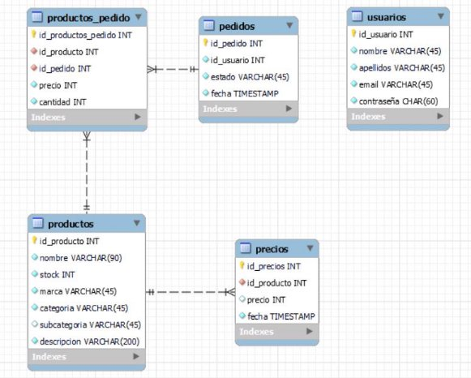

***Assignment brief A.B.* PORTADA **

|**Nombre Alumno / DNI** |` `**Rubén Valverde Romero / 05731212A** |
| - | - |
|**Título del Programa** |` `**Bachelor’s Degree in Data Science and Artificial Intelligence** |
|**Nº Unidad y Título** |**UNIT 4-DATA BASE DESIGN & DEVELOPMENT**|
|**Año académico** |` `**2023-2024** |
|**Profesor de la unidad** |**JAVIER SEGOVIA** |
|**Título del Assignment** |` `**AB FINAL** |
|**Día de emisión** |` `**19/01/2024** |
|**Día de entrega** |` `**28/01/2024** |
|**Nombre IV y fecha** ||
|**Declaración del estudiante** |
**Certifico que la presentación del assignment es completamente mi propio trabajo y entiendo completamente las consecuencias del plagio.** 

**Entiendo que hacer una declaración falsa es una forma de mala práctica.** 

**Fecha:  28/01/2024 Firma del alumno:** 

|

***Plagio*** 

*El plagio es una forma particular de hacer trampa. El plagio debe evitarse a toda costa y los alumnos que infrinjan  las  reglas,  aunque  sea  inocentemente,  pueden  ser  sancionados.  Es  su  responsabilidad asegurarse de comprender las prácticas de referencia correctas. Como alumno de nivel universitario, se espera  que  utilice  las  referencias  adecuadas  en  todo  momento  y  mantenga  notas  cuidadosamente* 

*detalladas de todas sus fuentes de materiales para el material que ha utilizado en su trabajo, incluido* 

*cualquier  material  descargado  de  Internet.  Consulte  al  profesor  de  la  unidad  correspondiente o al tutor del curso si necesita más consejos.* 

6  Rubén Valverde Romero | **RVR** 

` `RVR 

**Rubén Valverde Romero** 

28-01-2024 

**Indice** 

[**Introducción ................................................................................................................ 3** ](#_page3_x77.00_y51.04)[Funcionalidades ........................................................................................................... 3** ](#_page3_x77.00_y202.04)[Registro ............................................................................................................................ 3 ](#_page3_x77.00_y254.04)[Inicio de sesión ................................................................................................................. 3 ](#_page3_x77.00_y359.04)[Cabecera ........................................................................................................................... 3 ](#_page3_x77.00_y443.04)[Menú desplegable ........................................................................................................ 3 ](#_page3_x77.00_y542.04)[Buscador ....................................................................................................................... 3 ](#_page3_x77.00_y618.04)[Manual de usuario ....................................................................................................... 3](#_page3_x77.00_y680.04)

[Pie de página .................................................................................................................... 4 ](#_page4_x77.00_y51.04)[Catálogo de productos ..................................................................................................... 4 ](#_page4_x77.00_y130.04)[Producto ........................................................................................................................... 4 ](#_page4_x77.00_y278.04)[Carrito ........................................................................................................................... 4 ](#_page4_x77.00_y363.04)[Imagen .......................................................................................................................... 4 ](#_page4_x77.00_y465.04)[Cesta ................................................................................................................................. 4 ](#_page4_x77.00_y597.04)[Alterar........................................................................................................................... 4 ](#_page4_x77.00_y717.04)[Cuenta .............................................................................................................................. 4 ](#_page4_x77.00_y778.04)[Usuario ......................................................................................................................... 5 ](#_page5_x77.00_y51.04)[Pedidos ......................................................................................................................... 5 ](#_page5_x77.00_y148.04)[Pedido............................................................................................................................... 5 ](#_page5_x77.00_y230.04)[**Base de datos .............................................................................................................. 5** ](#_page5_x77.00_y349.04)[Programación .............................................................................................................. 6** ](#_page6_x77.00_y92.04)[Lenguajes .......................................................................................................................... 6 ](#_page6_x77.00_y146.04)[Librerías y Frameworks .................................................................................................... 6](#_page6_x77.00_y230.04)

**Introducción**

El proyecto final de Base de datos tiene como finalidad la creación de una web conectada a una base de datos SQL para un e-commerce ficticio “RVR” orientado a la venta de artículos tecnológicos. 

**Funcionalidades** 

**Registro** 

Permite al usuario crear una cuenta con la que realizar los pedidos. La contraseña es encriptada antes de insertarse en la base de datos. 

**Inicio de sesión** 

Busca el email en la base de datos y verifica la contraseña con el hash almacenado. 

**Cabecera** 

Facilita al usuario navegar por la web, contiene enlaces a todas las categorías de los productos, cesta de la compra, manual de usuario, la cuenta y un buscador. 

**Menú desplegable** 

En tablets y móviles las categorías son sustituidas por un botón con 3 barras que al pulsar las despliega verticalmente. 

**Buscador** 

Permite al usuario buscar productos a través de cadenas de texto. 

**Manual de usuario** 

Una guía sobre como navegar y utilizar la web. 

**Pie de página** 

Contiene un enlace a la cuenta del usuario / inicio de sesión, un enlace a Google maps con la ubicación de la tienda y un mini mapa con ella. 

**Catálogo de productos** 

Muestra una imagen, el nombre y marca de los productos en la base de datos con o sin filtrado previo. 

Los resultados se filtran a través del método GET, muestra los productos pertenecientes a una categoría o los productos cuyo y/o descripción contienen la cadena de texto enviada a través del buscador de la cabecera. 

**Producto** 

Muestra una imagen mediana, nombre, marca, precio, descripción y unidades en stock. 

**Carrito**  

Permite añadir o quitar unidades del producto a la cesta. 

Indica las el número de unidades que se han introducido con su coste total. Incluye un botón para eliminar todas las unidades seleccionadas del producto. 

**Imagen** 

Al hacer click en la imagen se oscurece el fondo y se muestra en el centro una imagen con mayor resolución. 

Nota: Debido al tamaño de la mayoría de imágenes almacenadas (300 x 300) se aprecia mejor el efecto es en los productos pertenecientes a la categoría “smartphones”. 

**Cesta** 

Aquí se muestran todos los productos que el usuario a añadido junto a su cantidad y precio. 

A través de un botón se confirma y realiza el pedido. 

**Alterar** 

Puedes quitar 1 o todas las unidades de un producto a través de botones a la derecha 

**Cuenta** 

**Usuario** 

Muestra el nombre, apellidos e email del cliente. 

Un botón para cerrar sesión y otro para eliminar la cuenta (se borra de la tabla usuarios, pero no afecta al resto) 

**Pedidos** 

Muestra la id, fecha y estado de todos los pedidos realizados. Contienen un botón para ver más detalles del pedido. 

**Pedido** 

Muestran su id, los productos que contienen, precio del producto, la cantidad y el coste total.  

**Base de datos** 

**Programación** 

**Lenguajes** 

HTML, CSS, JavaScript y PHP 

**Librerías y Frameworks** 

Bootstrap y Ajax
